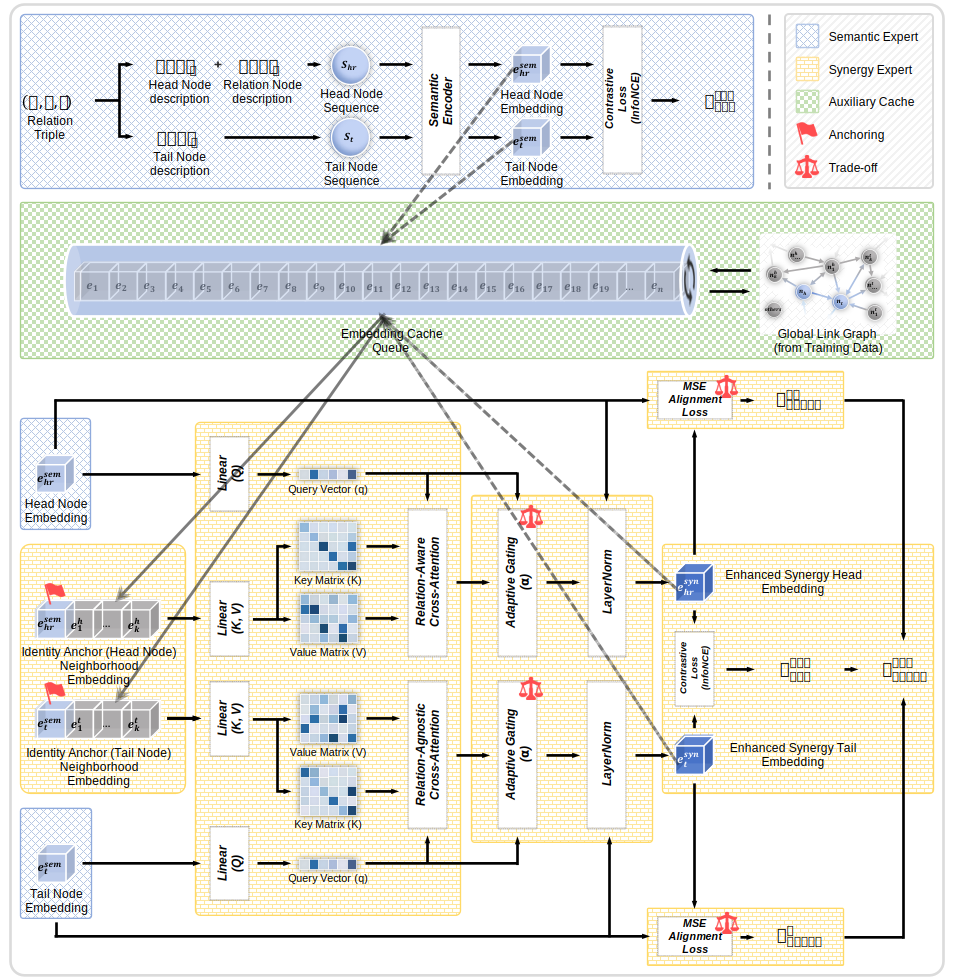

<p align="center">
  
</p>

<p align="center">
  
</p>

<p align="center">
  <strong>This repository provides the official implementation of our paper:</strong>
</p>

<p align="center">
  <a href="https://arxiv.org/abs/2602.10845" style="text-decoration: none;">
    <span style="font-family: Georgia, 'Times New Roman', serif; font-size: 1.5em; font-weight: bold; font-style: italic; color: #007bff;">
      SynergyKGC: Reconciling Topological Heterogeneity in Knowledge Graph Completion via Topology-Aware Synergy
    </span>
  </a>
</p>

> **Xuecheng Zou, Yu Tang, Bingbing Wang**
> 
> **SynergyKGC** is a high-precision dual-tower framework that leverages an instruction-driven synergy mechanism to fundamentally resolve topological heterogeneity in Knowledge Graph Completion (KGC). By advancing passive alignment to active cross-modal reconciliation, it ensures representational stability across the entire training-inference lifecycle.

<p align="center">
  
</p>

---

## 🌟 Overall Architecture

<p align="center">
  
  <br>
  <i><strong>Figure 1:</strong> The overall architecture of SynergyKGC, which establishes a progressive cross-modal reconciliation between latent semantic manifolds and explicit topological signals.</i>
</p>

---

## 💡 Core Mechanisms & Contributions

Traditional KGC methods suffer from **Passive Alignment**, failing to adapt to **Topological Heterogeneity**. This leads to **Representation Collapse** in sparse graphs and **Identity Redundancy** in dense clusters.

>**SynergyKGC** breaks these bottlenecks with four key innovations:
>* **🎯 Active Synergy (Instruction-Driven)**: Replaces passive aggregation by using semantic intent as an active query to retrieve and filter relevant topological contexts via relation-aware cross-attention.
>* **⛓️ Dual-Axis Consistency**: Enforces strict alignment across the **Architectural Axis** (Query/Entity towers) and the **Lifecycle Axis** (Training/Inference) to eliminate representation drift and distribution shift.
>* **⚖️ Identity Anchoring (IA)**: Formalizes the trade-off between structural sufficiency and identity redundancy. It provides a "positional scaffold" for sparse entities while filtering structural noise in dense regions.
>* **⚡ Catch-up Effect**: Triggers instantaneous synchronization of modal manifolds upon activation. This enables the model to bypass exhaustive warming phases (30+ epochs), slashing training overhead while boosting precision.

---

## 📊 Main Results

**SynergyKGC** establishes a new State-of-the-Art (SOTA) across both dense and sparse Knowledge Graph benchmarks. By reconciling topological heterogeneity, our framework achieves a comprehensive breakthrough over existing text-based and hybrid models.

### 🏆 Performance Comparison

| Dataset | MRR | Hits@1 | Hits@3 | Hits@10 |
| :--- | :---: | :---: | :---: | :---: |
| **FB15k-237** | **39.9** <br> (↑ 5.5) | **30.2** <br> (↑ 4.7) | **43.6** <br> (↑ 6.1) | **59.4** <br> (↑ 7.1) |
| **WN18RR** | **74.2** <br> (↑ 6.0) | **67.7** <br> **(↑ 8.0) 🥇** | **78.5** <br> (↑ 4.6) | **85.5** <br> (↑ 2.1) |

> **Note:** Improvements are calculated against the strongest hybrid baseline.

---

## ⚙️ Installation

To ensure reproducibility of our results, we recommend using **Conda** for environment management. **SynergyKGC** is implemented using `bert-base-uncased` as the semantic backbone. Training was conducted on a single **NVIDIA A100 (80GB)** to support the default batch size of 768.


### 1. Clone the Repository

```bash
git clone https://github.com/XuechengZou-2001/SynergyKGC-main.git
cd SynergyKGC-main
```

### 2. Install Dependencies

```bash
pip install -r requirements.txt
```

---

## 🚀 Quick Start & Reproducibility

We provide end-to-end scripts to reproduce the SOTA results reported in our paper. **SynergyKGC** operates in a two-phase training paradigm: foundational **Semantic Warming** followed by **Active Synergy Integration**.

### 🧠 1. Data Preparation

```bash
bash scripts/FB15k237_preprocess.sh
bash scripts/WN18RR_preprocess.sh
```

### 🔥 2. Training

```bash
bash scripts/FB15k237_train.sh
bash scripts/WN18RR_train.sh
```

### 🔬 3. Evaluation

```bash
bash scripts/FB15k237_evaluate.sh
bash scripts/WN18RR_evaluate.sh
```

> **Note:** The sentences "Please replace with your actual folder name." in. sh file needs to be replaced with the specific model path. Furthermore, we strongly recommend downloading `bert-base-uncased` locally and remembering its accurate path before the formal experiment begins.

---

## 📁 Project Structure

The codebase is organized to reflect the **Dual-Axis Consistency** and **Active Synergy** mechanisms. Below is a high-level overview of the directory tree:

```text
├── checkpoint/                  # Trained model weights
├── data/                        # Dataset directory
│   ├── FB15k-237/               # Pre-processed FB15k-237 files
│   └── WN18RR/                  # Pre-processed WN18RR files
├── figures/                     # Figures for display
│   └── SynergyKGC_framework.svg # Framework of SynergyKGC
├── predictions/                 # Prediction results of our model on the test sets
│   ├── FB15k-237/               # Prediction results on FB15k-237
│   └── WN18RR/                  # Prediction results on WN18RR
├── scripts/                     # Training & Evaluation automation
│   ├── FB15k237_evaluate.sh     # Bash script for FB15k-237 evaluation
│   ├── FB15k237_preprocess.sh   # Bash script for FB15k-237 preprocessing
│   ├── FB15k237_train.sh        # Bash script for FB15k-237 training
│   ├── WN18RR_evaluate.sh       # Bash script for WN18RR evaluation
│   ├── WN18RR_preprocess.sh     # Bash script for WN18RR preprocessing
│   └── WN18RR_train.sh          # Bash script for WN18RR training
├── config.py                    # Hyperparameter configs
├── main.py                      # Main entry for training
├── requirements.txt             # Environment dependencies
└── ...
```


